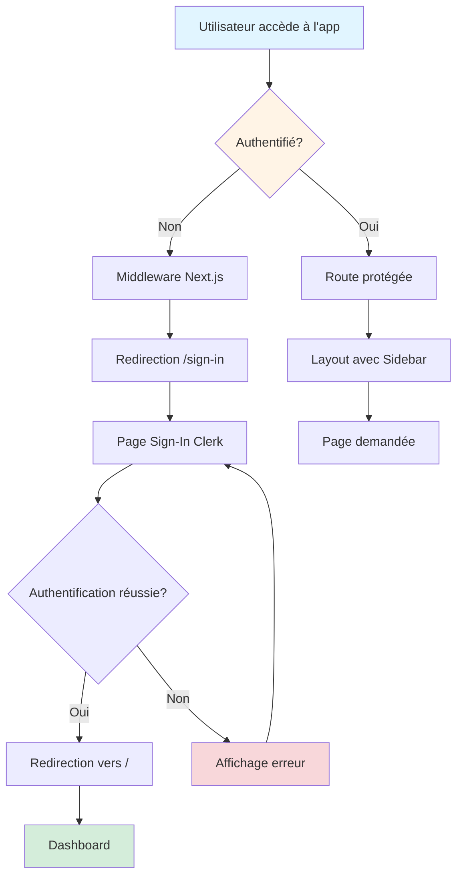
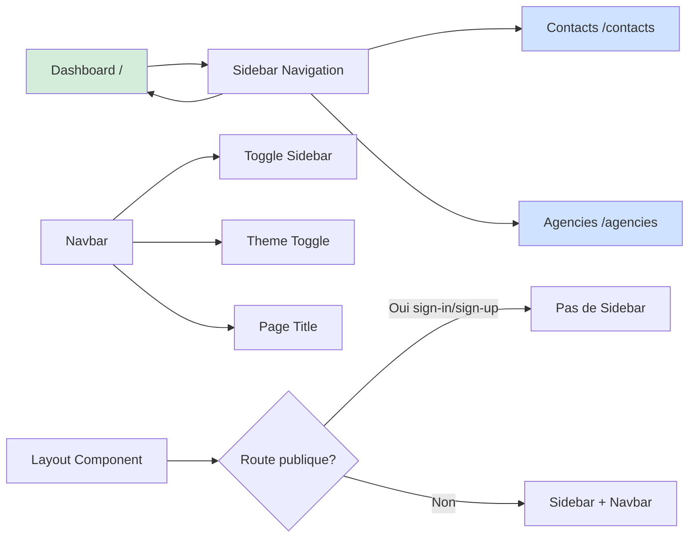
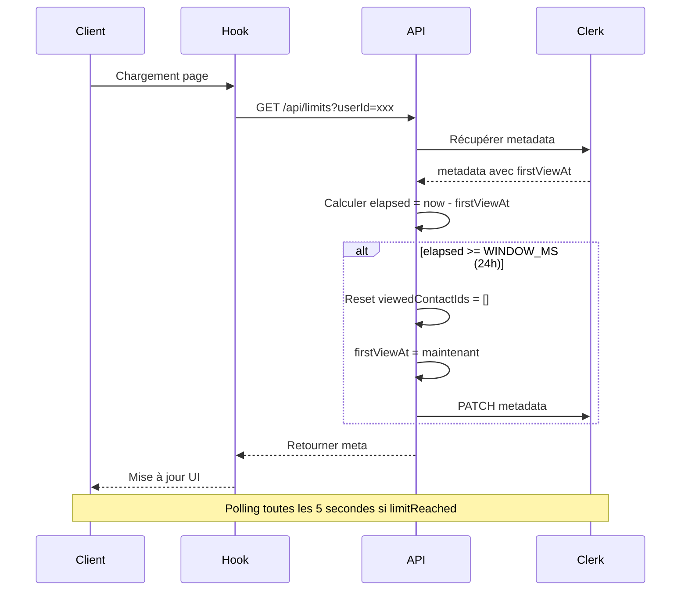
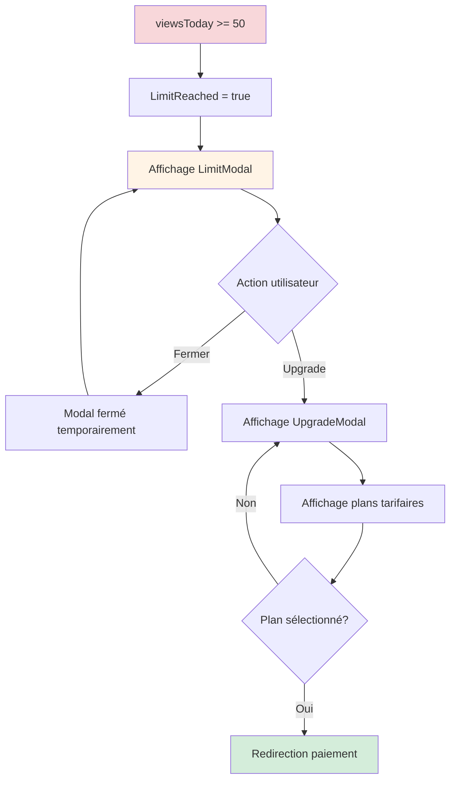
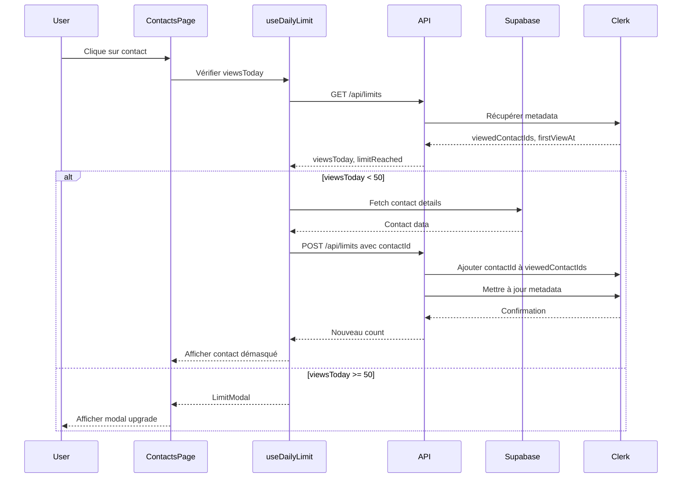
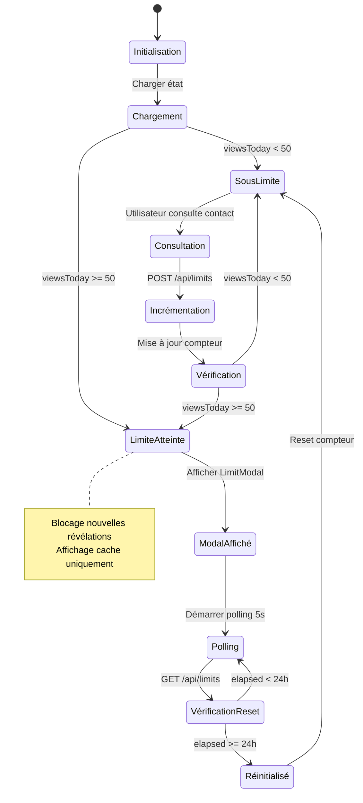
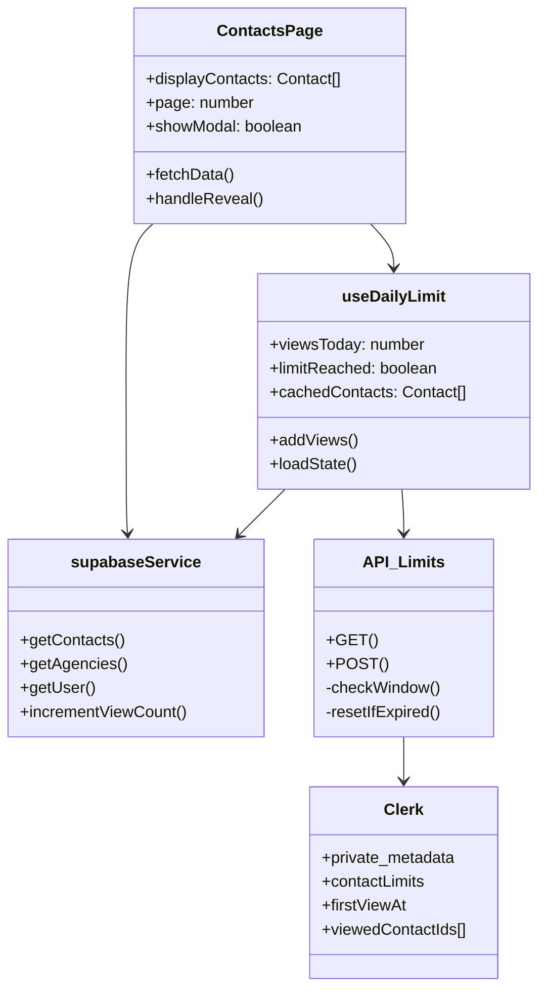
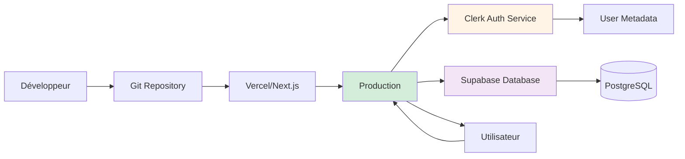

# Prompts Mermaid pour le projet ATLAS

## 📊 Diagrammes Mermaid prêts à utiliser

### 1. Flowchart d'Authentification



### 2. Flowchart de Navigation Principale



### 3. Flowchart de Visualisation des Contacts avec Limite

```mermaid
flowchart TD
    A[Utilisateur accède /contacts] --> B[Hook useDailyLimit]
    B --> C[GET /api/limits]
    C --> D[Vérification WINDOW_MS]
    D --> E{Fenêtre expirée?}
    E -->|Oui| F[Reset: viewedContactIds = []]
    E -->|Non| G[Récupération viewedContactIds]
    F --> H[firstViewAt = maintenant]
    G --> I[viewsToday = viewedContactIds.length]
    H --> I
    I --> J{viewsToday < 50?}
    J -->|Oui| K[Fetch Supabase contacts]
    K --> L[POST /api/limits avec contactIds]
    L --> M[Incrémenter compteur]
    M --> N[Affichage contacts masqués]
    N --> O[Utilisateur clique Reveal]
    O --> P[Données démasquées]
    J -->|Non| Q[Mode Cache]
    Q --> R[Affichage cachedContacts]
    Q --> S[LimitModal affiché]
    S --> T[Blocage nouvelles révélations]
    
    style J fill:#fff4e6
    style S fill:#f8d7da
    style M fill:#d4edda
```

### 4. Flowchart de Réinitialisation Quotidienne



### 5. Diagramme d'Architecture Générale

```mermaid
graph TB
    subgraph Frontend["Frontend - Next.js 16"]
        A[App Router]
        B[Pages: /, /contacts, /agencies]
        C[Components: Layout, Sidebar, Navbar]
        D[Hooks: useDailyLimit, useUser]
        E[Context: Theme, Sidebar]
    end
    
    subgraph Middleware["Middleware"]
        F[Vérification Clerk]
        G[Protection Routes]
    end
    
    subgraph API["API Routes"]
        H[/api/limits GET/POST]
    end
    
    subgraph Services["Services"]
        I[supabaseService]
    end
    
    subgraph Database["Supabase PostgreSQL"]
        J[(Table: contacts)]
        K[(Table: agencies)]
    end
    
    subgraph Auth["Clerk Authentication"]
        L[Sign-In/Sign-Up]
        M[private_metadata: contactLimits]
    end
    
    A --> B
    B --> C
    C --> D
    D --> E
    F --> G
    G --> A
    D --> H
    H --> I
    I --> J
    I --> K
    H --> M
    A --> L
    L --> M
    
    style Frontend fill:#e1f5ff
    style Database fill:#f3e5f5
    style Auth fill:#fff4e6
```

### 6. Flowchart d'Upgrade Modal



### 7. Diagramme de Séquence - Consultation d'un Contact



### 8. Diagramme d'État - Système de Limite



### 9. Diagramme de Classes Simplifié



### 10. Diagramme de Déploiement



## 📝 Instructions d'utilisation

1. **Copier-coller** n'importe quel diagramme dans un éditeur Mermaid (comme [Mermaid Live Editor](https://mermaid.live))
2. **Modifier** selon vos besoins
3. **Exporter** en PNG, SVG ou intégrer dans votre documentation

## 🎨 Personnalisation

- Modifiez les couleurs avec `style` dans les flowcharts
- Ajoutez des notes avec `note right/left of`
- Personnalisez les formes avec différentes syntaxes Mermaid
- Ajoutez des liens interactifs si nécessaire

## 🔗 Ressources Mermaid

- [Documentation officielle](https://mermaid.js.org/)
- [Mermaid Live Editor](https://mermaid.live)
- [Syntaxe des diagrammes](https://mermaid.js.org/intro/syntax-reference.html)

